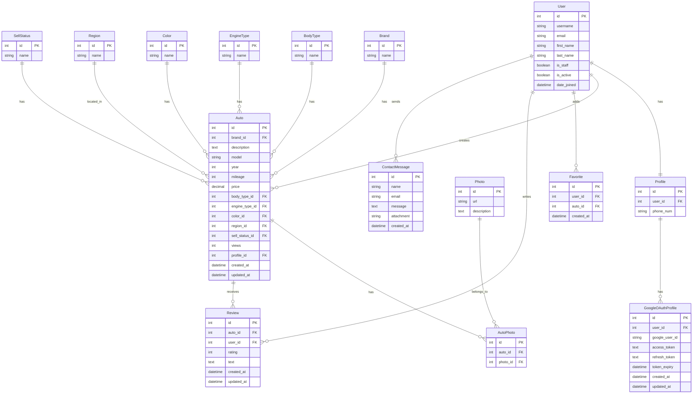

# ER-диаграмма проекта CarSales

## Описание связей:

1. **User ↔ Profile**: Один к одному - каждый пользователь имеет один профиль
2. **Profile → GoogleOAuthProfile**: Один ко многим - профиль может иметь несколько OAuth-профилей
3. **User → Auto**: Один ко многим - пользователь может создать несколько объявлений
4. **User → Favorite**: Один ко многим - пользователь может добавить несколько автомобилей в избранное
5. **User → Review**: Один ко многим - пользователь может оставить несколько отзывов
6. **User → ContactMessage**: Один ко многим - пользователь может отправить несколько сообщений

7. **Brand → Auto**: Один ко многим - одна марка может быть у многих автомобилей
8. **BodyType → Auto**: Один ко многим - один тип кузова может быть у многих автомобилей
9. **EngineType → Auto**: Один ко многим - один тип двигателя может быть у многих автомобилей
10. **Color → Auto**: Один ко многим - один цвет может быть у многих автомобилей
11. **Region → Auto**: Один ко многим - один регион может содержать много автомобилей
12. **SellStatus → Auto**: Один ко многим - один статус может быть у многих автомобилей

13. **Auto ↔ AutoPhoto ↔ Photo**: Многие ко многим через промежуточную таблицу
14. **Auto → Review**: Один ко многим - один автомобиль может иметь много отзывов

## Особенности:
- **AutoPhoto** - промежуточная таблица для связи M2M между Auto и Photo
- **Favorite** - уникальное ограничение на пару (user, auto)
- **Review** - уникальное ограничение на пару (user, auto)
- **Auto** наследует от TimeStamped (created_at, updated_at)
- **Auto** имеет кастомный менеджер AutoManager с методом available()
- **Auto** имеет метод is_premium() для определения премиум-автомобилей 